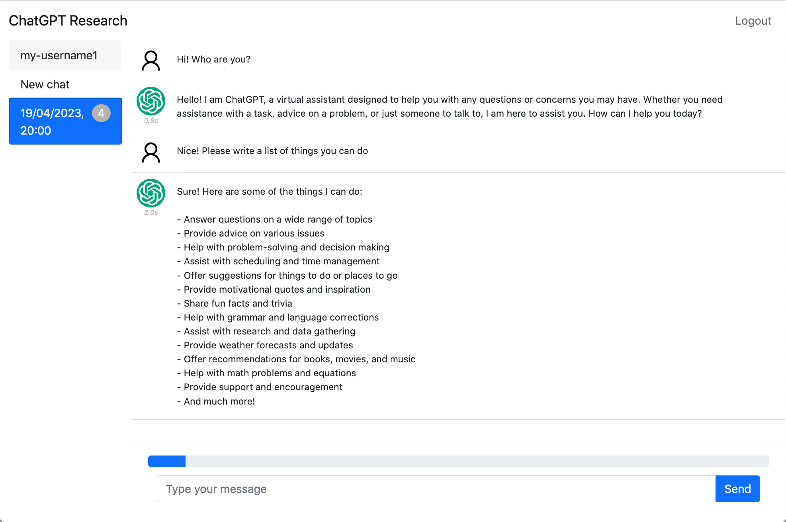

# ChatGPT Research
This web application facilitates researchers in conducting in-depth studies and analysis of user conversations. The website is structured similarly to the original ChatGPT portal, and it is connected to OpenAI's ChatGPT-API. This platform allows researchers to collect and store user interactions for later analysis and publication of their findings.

**DISCLAIMER:** *This repository contains software code for my own experimentation and learning. I offer it to the public as-is, with absolutely no guarantee of suitability for any purpose. Furthermore, I accept no responsibility for any damages or legal issues that may arise from the use or misuse of this code. By using this software, you acknowledge and accept this disclaimer in full.*


More screenshots [here](misc/screenshots).

## Setup
1. Install docker
2. Set the following environment variables:
    - MONGOURI
    - OPENAI_API_KEY
    - OPENAI_ORGANIZATION
    - CHATGPT_RESEARCH_SECRET
    - NWORKERS (number of cpus)
3. Modify `nginx/conf/nginx.conf` by performing the following changes:
    - Replace `mywebsitedomain.com` with your domain.
    - Temporarily remove the section `server { listen 443 ...}`.
4. Run `docker compose up --build`
5. Test certbot to obtain your certificates using the following command:
```
docker compose run --rm  certbot certonly --webroot --webroot-path /var/www/certbot/ --dry-run -d example.org -d www.example.org
```
6. If the test is successful, run the same command without `--dryrun`
7. Restore the section server `server { listen 443 ...}` in `nginx/conf/nginx.conf`.
8. Run `docker compose up --build` again (You may need to run `docker compose down` first).

To renew your certificates::
```
docker compose run --rm certbot renew
```

## References
- https://stackoverflow.com/questions/10938360/how-many-concurrent-requests-does-a-single-flask-process-receive
- https://mindsers.blog/post/https-using-nginx-certbot-docker/
